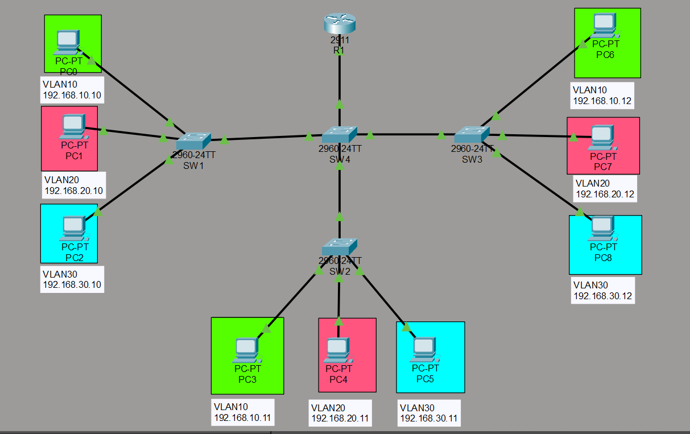
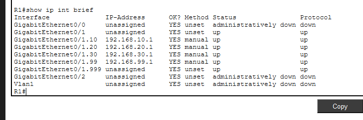
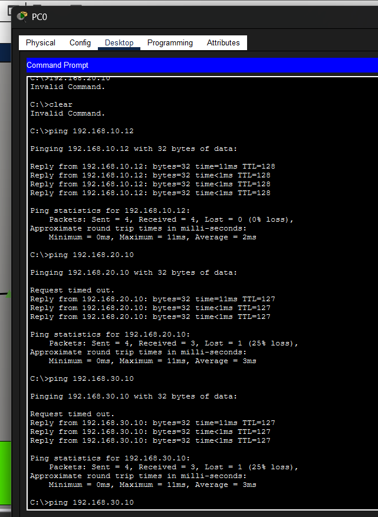
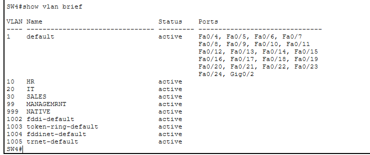
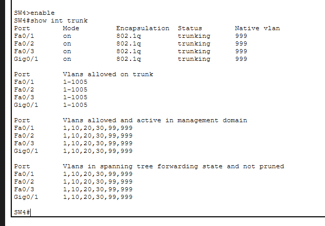

# 🏢 Enterprise Campus Network: Inter-VLAN Routing & Layer 2 Security

A Cisco Packet Tracer lab demonstrating VLAN segmentation, secure trunking, and inter-VLAN routing for enterprise campus networks.

### Table of Contents
1. [📘 Project Overview](#-project-overview)
2. [🎯 Project Objectives](#-project-objectives)
3. [🌐 Network Topology](#-network-topology)
4. [🔌 Device Connection Table](#-device-connection-table)
5. [🧮 IP Addressing Table](#-ip-addressing-table)
6. [💻 Device Configuration](#-device-configuration)
7. [✅ Verification Commands](#-verification-commands)
8. [⚡ How to Run Lab](#-how-to-run-lab)
9. [📁 Folder Structure](#-folder-structure)
10. [🎓 Learning Outcomes](#-learning-outcomes)

---

## 📘 Project Overview
This project simulates a secure, multi-tier enterprise network architecture. It utilizes Layer 2 VLAN segmentation to isolate departmental broadcast domains and implements a Router-on-a-Stick (RoaS) configuration for controlled inter-VLAN communication. Security best practices, including Native VLAN blackholing and Out-of-Band Management (OOBM), are actively enforced.

## 🎯 Project Objectives
* Design a Hierarchical Network Model utilizing Access and Distribution layer switches.
* Segment broadcast domains by department (HR, IT, Sales) using IEEE 802.1Q VLANs.
* Secure inter-switch trunk links by overriding the default Native VLAN 1.
* Establish secure remote administration via Switch Virtual Interfaces (SVIs) on a dedicated Management VLAN.
* Enable cross-departmental routing using sub-interfaces on a Cisco Core Router.

---

## 🌐 Network Topology


---

## 🔌 Device Connection Table

| Device | Interface | Connected To | Notes |
| :--- | :--- | :--- | :--- |
| **Router0** | G0/1 | SW4 (G0/1) | 802.1Q Trunk link for Router-on-a-Stick |
| **SW4 (Dist)** | F0/1 - F0/3 | SW1, SW2, SW3 | 802.1Q Trunk links carrying VLANs 10, 20, 30, 99 |
| **SW1 - SW3** | F0/4 | SW4 (Dist) | Uplink Trunks to Distribution Switch |
| **SW1 - SW3** | F0/1 | HR PCs | Access Ports (VLAN 10) |
| **SW1 - SW3** | F0/2 | IT PCs | Access Ports (VLAN 20) |
| **SW1 - SW3** | F0/3 | Sales PCs | Access Ports (VLAN 30) |

---

## 🧮 IP Addressing Table

| Device / Interface | IP Address | Subnet Mask | Default Gateway | VLAN / Notes |
| :--- | :--- | :--- | :--- | :--- |
| **R1 (G0/0.10)** | `192.168.10.1` | `255.255.255.0` | - | VLAN 10 (HR Gateway) |
| **R1 (G0/0.20)** | `192.168.20.1` | `255.255.255.0` | - | VLAN 20 (IT Gateway) |
| **R1 (G0/0.30)** | `192.168.30.1` | `255.255.255.0` | - | VLAN 30 (Sales Gateway) |
| **R1 (G0/0.99)** | `192.168.99.1` | `255.255.255.0` | - | VLAN 99 (Mgmt Gateway) |
| **R1 (G0/0.999)**| *Unassigned* | *Unassigned* | - | VLAN 999 (Native / Drop) |
| **SW4 (VLAN 99)** | `192.168.99.13` | `255.255.255.0` | `192.168.99.1` | Dist Switch SVI |
| **SW3 (VLAN 99)** | `192.168.99.12` | `255.255.255.0` | `192.168.99.1` | Access Switch SVI |
| **SW2 (VLAN 99)** | `192.168.99.11` | `255.255.255.0` | `192.168.99.1` | Access Switch SVI |
| **SW1 (VLAN 99)** | `192.168.99.10` | `255.255.255.0` | `192.168.99.1` | Access Switch SVI |
| **End User PCs** | `192.168.x.10+`| `255.255.255.0` | `192.168.x.1` | IP dictated by local VLAN |
---

## 💻 Device Configuration
The full raw text configuration scripts for the routing and switching infrastructure can be found in the [`/configs`](./configs) directory of this repository.
* 🖧 [Core Router Configuration](./configs/r1.cfg)
* 🔀 [Distribution Switch Configuration](./configs/sw4.cfg)
* 🔀 [Switch 1 Configuration](./configs/sw1.cfg)
* 🔀 [Switch 2 Configuration](./configs/sw2.cfg) 
* 🔀 [Switch 3 Configuration](./configs/sw3.cfg)
  
---
## ✅ Verification Commands

**1. Verifying IP Configuration (`show ip interfaces brief`).**
Shows succesfully assigned ip addresses for subinterfaces.



**2. Verifying Inter-VLAN Routing (ICMP Ping Test)**
Successful ping from the PC0 from HR VLAN to IT and SALES VLANS.



**3. Verifying VLAN Assignments (`show vlan brief`)**
Confirms that all VLANS are created correctly.



**4. Verifying Trunking & Native VLAN Security (`show interfaces trunk`)**
Validates that 802.1Q encapsulation is active on inter-switch links and the Native VLAN has been successfully migrated to VLAN 999.



---

## ⚡ How to Run Lab
1. Download the `inter-vlan-campus.pkt` file from this repository.
2. Open the file using Cisco Packet Tracer.
3. Access any PC terminal (e.g., PC0 in HR) and open the Command Prompt.
4. Execute ping tests to endpoints in varying VLAN subnets (e.g., `ping 192.168.30.10`) to witness successful Inter-VLAN routing.

---

## 📁 Folder Structure
```text
01-Inter-VLAN-Campus-Network/
│
├── configs/
│   ├── r1.cfg
│   └── sw4.cfg
│   └── sw3.cfg
│   └── sw2.cfg
│   └── sw1.cfg
│
├──verification/
│   ├── ip.png
│   └── ping.png
│   └── trunk.png
│   └── vlans.png
│
├── README.md
├── topology.png
└── inter-vlan-campus.pkt
```

---

## 🎓 Learning Outcomes
By completing this architecture, I gained hands-on experience with the following enterprise networking concepts:
* **Switchport Configuration:** Created VLAN databases from the CLI and mapped physical interfaces to strict access ports to isolate departmental traffic.
* **Native VLAN Hardening:** Configured 802.1Q trunk links across the distribution/access layer and actively resolved "Native VLAN Mismatch" errors by successfully migrating untagged traffic to a blackhole VLAN (999).
* **Out-of-Band Management (OOBM):** Engineered Switch Virtual Interfaces (SVIs) on a dedicated Management VLAN (99) and assigned global default gateways to Layer 2 switches to enable remote administration.
* **Router-on-a-Stick (RoaS):** Designed Layer 3 sub-interfaces with `encapsulation dot1Q` to facilitate inter-VLAN routing while preserving physical router port density. 
* **Real-time Troubleshooting:** Successfully diagnosed and resolved link-state issues (`no shutdown`), verified physical cabling mapping, and validated ARP resolution behavior during initial ICMP (ping) connectivity testing.
