# 🏢 Enterprise Campus Network: High Availability with EtherChannel & STP

A Cisco Packet Tracer lab demonstrating redundant campus switching, EtherChannel link aggregation, Rapid PVST+ loop prevention, and inter-VLAN routing for enterprise campus networks.

## Table of Contents

1. 🔷 [Project Overview](#project-overview)
2. 🎯 [Project Objectives](#project-objectives)
3. 🌐 [Network Topology](#network-topology)
4. 🔌 [Device Connection Table](#device-connection-table)
5. 🌈 [VLAN Design](#vlan-design)
6. 🧾 [IP Addressing Table](#ip-addressing-table)
7. 🔗 [EtherChannel Design](#etherchannel-design)
8. 🌳 [STP Design](#stp-design)
9. 💻 [Device Configuration Files](#device-configuration-files)
10. ⚙️ [Key Configuration Examples](#key-configuration-examples)
11. ✅ [Verification Commands](#verification-commands)
12. 📸 [Verification Screenshots](#verification-screenshots)
13. ⚡ [Failure Testing](#failure-testing)
14. 🛠️ [Troubleshooting Note](#troubleshooting-note)
15. 🚀 [How to Run This Lab](#how-to-run-this-lab)
16. 📁 [Folder Structure](#folder-structure)
17. 🎓 [Learning Outcomes](#learning-outcomes)
18. 🧩 [Conclusion](#conclusion)

---

## 🔷 Project Overview

This project demonstrates a high availability campus switching design using **EtherChannel**, **Rapid PVST+**, **VLANs**, **trunking**, and **Layer 3 switch inter-VLAN routing**.

The network is designed with redundant switch paths to improve availability. EtherChannel is used to bundle multiple physical links into one logical link, while STP prevents Layer 2 loops and provides backup path selection. A Layer 3 switch is used as the core switch to route traffic between VLAN 10 and VLAN 20.

This lab was built and tested in **Cisco Packet Tracer**.

---

## 🎯 Project Objectives

The main objectives of this lab are:

- Design a redundant campus switching topology.
- Configure VLAN 10 and VLAN 20 across multiple switches.
- Configure access ports for end-user devices.
- Configure EtherChannel using LACP.
- Configure trunk links to carry multiple VLANs.
- Enable Rapid PVST+ for loop prevention.
- Configure SW1 as the STP root bridge.
- Configure SW2 as the secondary root bridge.
- Configure inter-VLAN routing using SVIs on a Layer 3 switch.
- Verify VLAN, trunk, EtherChannel, STP, and routing operation.
- Test high availability by simulating link and path failures.

---

## Technologies Used

- Cisco Packet Tracer
- VLANs
- 802.1Q Trunking
- EtherChannel
- LACP
- Rapid PVST+
- STP Root Bridge
- Layer 3 Switch SVIs
- Inter-VLAN Routing
- Link Failure Testing

---

## 🌐 Network Topology

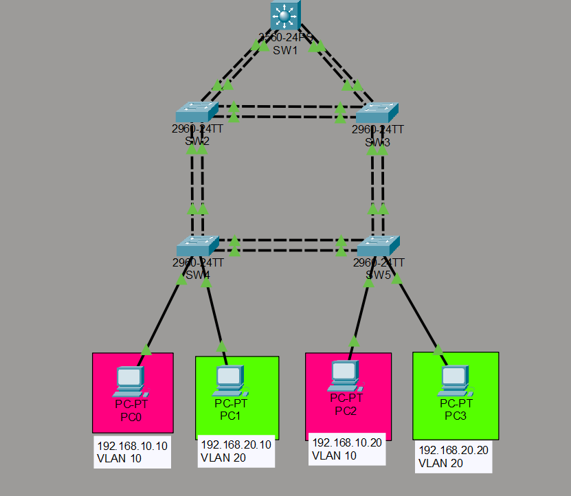

---

## Device Roles

| Device | Role |
|---|---|
| SW1 | Layer 3 core switch, STP root bridge, VLAN gateway |
| SW2 | Distribution switch, secondary STP root bridge |
| SW3 | Distribution switch |
| SW4 | Access switch for PC0 and PC1 |
| SW5 | Access switch for PC2 and PC3 |
| PC0 | VLAN 10 host |
| PC1 | VLAN 20 host |
| PC2 | VLAN 10 host |
| PC3 | VLAN 20 host |

---

## 🔌 Device Connection Table

| Connection | Link Type | Port-Channel | Purpose |
|---|---|---|---|
| SW1 ↔ SW2 | EtherChannel trunk | Po1 | Core to distribution redundancy |
| SW1 ↔ SW3 | EtherChannel trunk | Po2 | Core to distribution redundancy |
| SW2 ↔ SW3 | EtherChannel trunk | Po3 | Distribution layer redundancy |
| SW2 ↔ SW4 | EtherChannel trunk | Po4 | Access switch uplink redundancy |
| SW3 ↔ SW5 | EtherChannel trunk | Po5 | Access switch uplink redundancy |
| SW4 ↔ SW5 | EtherChannel trunk | Po6 | Access layer backup path |
| SW4 ↔ PC0 | Access port | - | VLAN 10 host |
| SW4 ↔ PC1 | Access port | - | VLAN 20 host |
| SW5 ↔ PC2 | Access port | - | VLAN 10 host |
| SW5 ↔ PC3 | Access port | - | VLAN 20 host |

---

## 🌈 VLAN Design

| VLAN | Name | Network | Default Gateway |
|---|---|---|---|
| VLAN 10 | STUDENTS | 192.168.10.0/24 | 192.168.10.1 |
| VLAN 20 | STAFF | 192.168.20.0/24 | 192.168.20.1 |

---

## 🧾 IP Addressing Table

| Device | VLAN | IP Address | Subnet Mask | Default Gateway |
|---|---|---|---|---|
| PC0 | VLAN 10 | 192.168.10.10 | 255.255.255.0 | 192.168.10.1 |
| PC1 | VLAN 20 | 192.168.20.10 | 255.255.255.0 | 192.168.20.1 |
| PC2 | VLAN 10 | 192.168.10.20 | 255.255.255.0 | 192.168.10.1 |
| PC3 | VLAN 20 | 192.168.20.20 | 255.255.255.0 | 192.168.20.1 |
| SW1 VLAN 10 SVI | VLAN 10 | 192.168.10.1 | 255.255.255.0 | - |
| SW1 VLAN 20 SVI | VLAN 20 | 192.168.20.1 | 255.255.255.0 | - |

---

##  EtherChannel Design

All EtherChannels in this lab use **LACP**.

| Link | Port-Channel | Protocol | VLANs Allowed |
|---|---|---|---|
| SW1 ↔ SW2 | Po1 | LACP | 10, 20 |
| SW1 ↔ SW3 | Po2 | LACP | 10, 20 |
| SW2 ↔ SW3 | Po3 | LACP | 10, 20 |
| SW2 ↔ SW4 | Po4 | LACP | 10, 20 |
| SW3 ↔ SW5 | Po5 | LACP | 10, 20 |
| SW4 ↔ SW5 | Po6 | LACP | 10, 20 |

EtherChannel allows multiple physical links to operate as one logical link. This improves bandwidth and provides link redundancy. If one physical member link fails, the Port-channel can continue forwarding traffic using the remaining active member link.

---

## 🌳 STP Design

Rapid PVST+ is used in this lab to prevent Layer 2 loops.

| Switch | STP Role |
|---|---|
| SW1 | Root bridge for VLAN 10 and VLAN 20 |
| SW2 | Secondary root bridge for VLAN 10 and VLAN 20 |
| SW3 | Non-root switch |
| SW4 | Access switch |
| SW5 | Access switch |

Important STP concept in this lab:

> STP treats each EtherChannel bundle as one logical link. This means STP forwards or blocks the Port-channel interface, not each physical cable individually.

---

## 💻 Device Configuration Files

The full switch configurations are stored in the `configs/` folder.

| Device | Configuration File |
|---|---|
| SW1 | [configs/sw1.cfg](configs/sw1.cfg) |
| SW2 | [configs/sw2.cfg](configs/sw2.cfg) |
| SW3 | [configs/sw3.cfg](configs/sw3.cfg) |
| SW4 | [configs/sw4.cfg](configs/sw4.cfg) |
| SW5 | [configs/sw5.cfg](configs/sw5.cfg) |

---

## ⚙️ Key Configuration Examples

### VLAN Configuration

```bash
vlan 10
 name STUDENTS
vlan 20
 name STAFF
```

### Access Port Configuration

```bash
interface fa0/1
 switchport mode access
 switchport access vlan 10
 spanning-tree portfast
 spanning-tree bpduguard enable

interface fa0/2
 switchport mode access
 switchport access vlan 20
 spanning-tree portfast
 spanning-tree bpduguard enable
```

### EtherChannel Configuration

```bash
interface range fa0/1 - 2
 switchport mode trunk
 switchport trunk allowed vlan 10,20
 channel-group 1 mode active
 no shutdown

interface port-channel 1
 switchport mode trunk
 switchport trunk allowed vlan 10,20
```

### Rapid PVST+ Configuration

```bash
spanning-tree mode rapid-pvst
```

### STP Root Bridge Configuration

SW1 was configured as the primary root bridge.

```bash
spanning-tree vlan 10,20 root primary
```

SW2 was configured as the secondary root bridge.

```bash
spanning-tree vlan 10,20 root secondary
```

### Inter-VLAN Routing on SW1

```bash
ip routing

interface vlan 10
 ip address 192.168.10.1 255.255.255.0
 no shutdown

interface vlan 20
 ip address 192.168.20.1 255.255.255.0
 no shutdown
```

---

## ✅ Verification Commands

The following commands were used to verify the lab:

```bash
show ip interface brief
show vlan brief
show etherchannel summary
show interfaces trunk
show spanning-tree vlan 10
show spanning-tree vlan 20
show mac address-table
ping
```

---

## 📸 Verification Screenshots

### 1. SW1 SVI Gateways

This verifies that VLAN 10 and VLAN 20 SVIs are configured and operational on SW1.

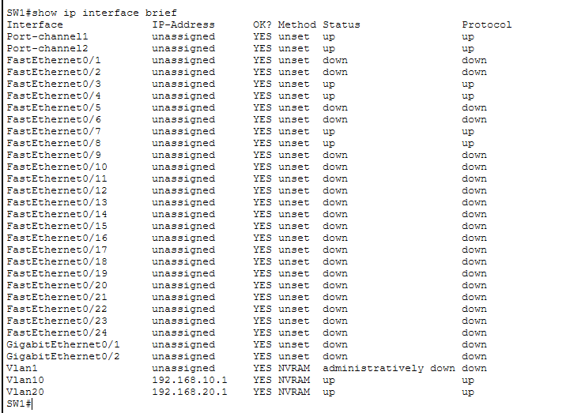

---

### 2. SW1 EtherChannel Summary

This verifies that SW1 has working EtherChannel links toward the distribution switches.

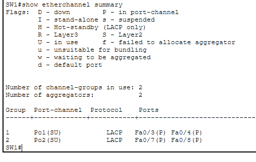

---

### 3. SW4 EtherChannel Summary

This verifies that the access switch has working EtherChannel uplinks.

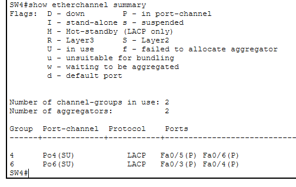

---

### 4. Trunk Verification

This verifies that the trunk links are allowing VLAN 10 and VLAN 20.

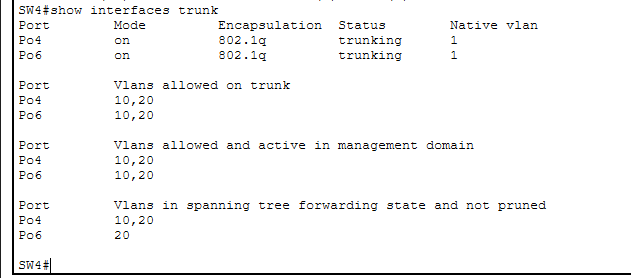

---

### 5. VLAN Access Port Verification

This verifies that PC ports are assigned to the correct VLANs.

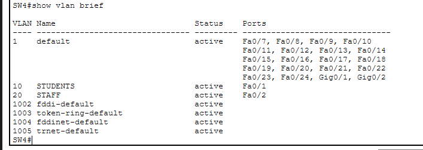

---

### 6. STP VLAN 10 Root Bridge

This verifies that SW1 is the root bridge for VLAN 10.

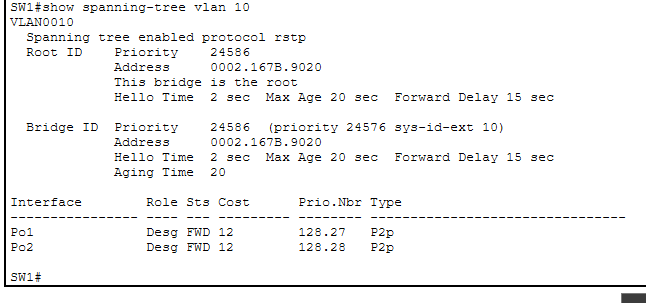

---

### 7. STP VLAN 20 Root Bridge

This verifies that SW1 is the root bridge for VLAN 20.

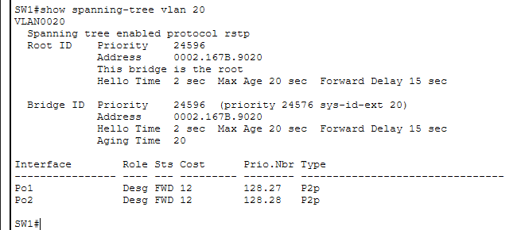

---

### 8. Ping Success

This verifies end-to-end connectivity between the VLAN hosts.

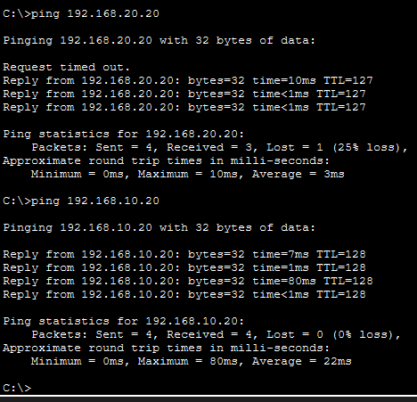

---

## ⚡ Failure Testing

### EtherChannel Status Before Failure

This shows the EtherChannel state before shutting down a physical member link.

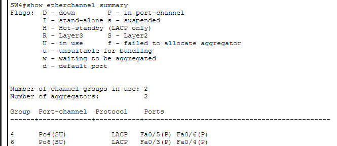

---

### EtherChannel Member Link Failure

One physical interface inside an EtherChannel bundle was shut down to test link redundancy. The Port-channel stayed operational because another member link was still active.

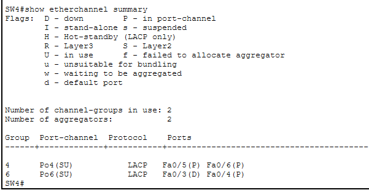

---

### Connectivity After EtherChannel Member Failure

After shutting down one EtherChannel member link, end-to-end connectivity was tested again using ping. The ping remained successful.

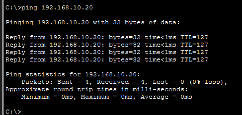

---

### STP Status Before Failure

This shows the STP state before shutting down a full Port-channel path.

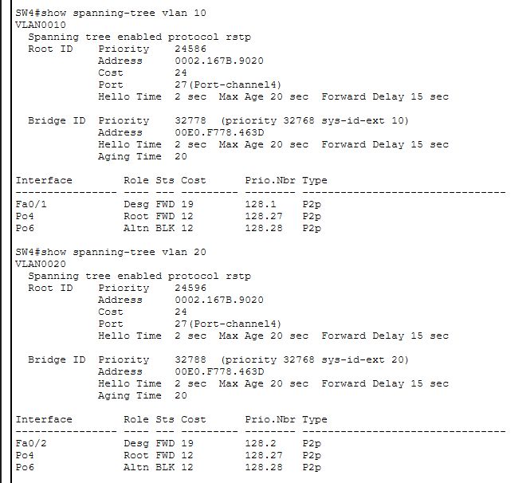

---

### STP Status After Port-Channel Failure

A full Port-channel path was shut down to test Rapid PVST+ failover. STP recalculated the topology and selected an alternate forwarding path.

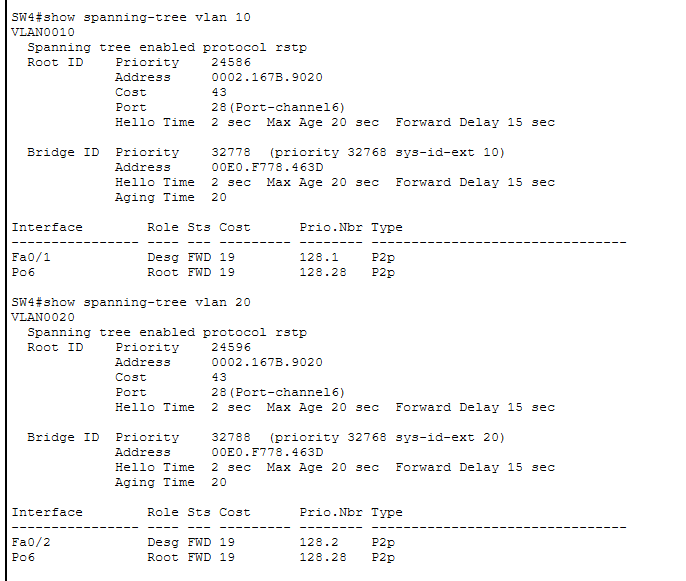

---

### Connectivity After STP Failover

After the STP failover test, end-to-end connectivity was tested again using ping. The ping remained successful through the alternate path.

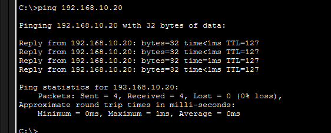
---

## 🛠️ Troubleshooting Note

During testing, VLAN 20 connectivity initially failed. i checked the VLANs, trunks, SVIs, and STP configuration and all looked correct. After power-cycling the Packet Tracer switches, the MAC address table and STP state refreshed, and connectivity worked correctly. So sometimes we just need to turn on and off the device once.

This was an important troubleshooting lesson because it showed that sometimes the configuration may be correct, but the device state or simulation state may need to refresh.

---

## 🚀 How to Run This Lab

1. Download the Packet Tracer file from this repository.
2. Open the `.pkt` file using Cisco Packet Tracer.
3. Verify the switch configuration using:
   ```bash
   show vlan brief
   show etherchannel summary
   show interfaces trunk
   ```
4. Verify STP operation using:
   ```bash
   show spanning-tree vlan 10
   show spanning-tree vlan 20
   ```
5. Verify SW1 SVI gateways using:
   ```bash
   show ip interface brief
   ```
6. Open the PC command prompt and test connectivity using:
   ```bash
   ping 192.168.10.20
   ping 192.168.20.20
   ```
7. Test high availability by shutting down one physical EtherChannel member link or one full Port-channel path.

---

## 📁 Folder Structure

```text
02-Campus-Switching-High-Availability/
│
├── configs/
│   ├── sw1.cfg
│   ├── sw2.cfg
│   ├── sw3.cfg
│   ├── sw4.cfg
│   └── sw5.cfg
│
├── verify/
│   ├── 01-sw1-svi-gateways.png
│   ├── 02-sw1-etherchannel-summary.png
│   ├── 03-sw4-etherchannel-summary.png
│   ├── 04-trunk-verification.png
│   ├── 05-vlan-access-ports.png
│   ├── 06-stp-vlan10-root.png
│   ├── 07-stp-vlan20-root.png
│   ├── 08-ping-success.png
│   ├── 09-etherchannel-before-failure.png
│   ├── 10-etherchannel-after-member-failure.png
│   ├── 11-link-failure-ping-success.png
│   ├── 12-stp-before-failure.png
│   ├── 13-stp-after-portchannel-failure.png
│   └── 14-stp-failover-ping-success.png
│
├── README.md
├── topology.png
└── high-availability-etherchannel-stp.pkt
```

---

## 🎓 Learning Outcomes

By completing this lab, I practiced and improved the following networking skills:

- Designed a redundant campus switching topology.
- Configured VLANs across multiple switches.
- Configured access ports for end devices.
- Configured EtherChannel using LACP.
- Configured trunk links over Port-channel interfaces.
- Verified EtherChannel using `show etherchannel summary`.
- Configured Rapid PVST+ for loop prevention.
- Controlled STP root bridge election.
- Configured inter-VLAN routing using SVIs on a Layer 3 switch.
- Verified connectivity between VLAN 10 and VLAN 20.
- Tested high availability during physical link and Port-channel failures.
- Practiced real troubleshooting using MAC tables, STP output, trunk verification, and ping tests.

---

## 🧩 Conclusion

This lab shows how EtherChannel and STP work together to provide high availability in a switched campus network.

EtherChannel improves redundancy and bandwidth by combining multiple physical links into one logical link. STP prevents Layer 2 loops and allows backup paths to be used when failures occur. The Layer 3 switch provides inter-VLAN routing so that hosts in different VLANs can communicate.

Overall, this project demonstrates important enterprise switching concepts used in real network environments.
